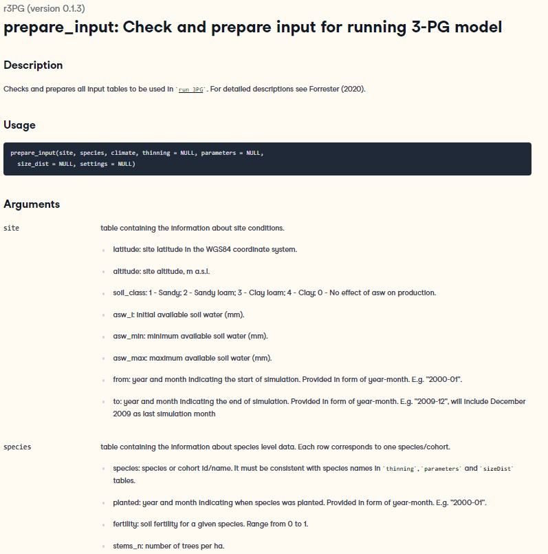

```{r setup, include=FALSE}
knitr::opts_chunk$set(echo = TRUE)
```

## 1.Introduction

Physiological Processes Predicting Growth （3PG）First published by [Landsberg and Warning (1997)] https://www.sciencedirect.com/science/article/pii/S0378112797000261).

The goal of 3PG is to predict forest productivity and evapotranspiration based on physiological processes. The core assumption is gross primary production (GPP) can be calculated from solar irridiance and light use efficiency, while light use efficiency depends on temperature, humidity, soil moisture, soil nutrient, tree age and atmospheric carbon dioxide concentration (Ca).

The key features of the 3PG are: 1. detailed physiological processes; 2. realistic climate change responses; 3. dynamics species composition; 4. Easy to use considering it capability.

3PG runs on a monthly time step with a spatial resolution undefined. The model minimum climate inputs are solar radiation, precipitation, temperature and humidity. There are 82 physiological parameters and 54 parameters describing the initial state.

Given the advantages of 3PG, it has been widely adapted around the world and is one of the most common model used in forestry. Studies using 3PG are now over 100.


Fig 1. Studies sites used 3PG.


There are a number of useful materials online: 
<https://3pg.forestry.ubc.ca/>

The version that we are using today is：
<https://doi.org/10.1111/2041-210X.13474>

## 2. Model sttructure
3PG has a structure that is typical for most land surface models. The basic assumption is, plants turn solar radiation into carbon, which is then used to grow root, stem and foliage.


Fig 2. Flow chart of key processes in 3PG.

## 3.Programing language
We use the R language<https://www.r-project.org/> and RStudio IDE <https://www.rstudio.com/>. The details of how to install and use the software are avaibile through the links.

Briefly, R is a programming language designed for statistics but now adapted many features which makes it as capable as any other languages. It is the most commonly used language in scientific research.

The package we will use today is ‘r3PG’.

```{r message=F}
# Install the package
if(require('r3PG') == FALSE){
  install.packages('r3PG')
} 

# 
library('r3PG')
```

## 4.Getting familiar with the code

### 4.1 Find help 

The most important thing to deal with unknown information in R–and in any programming language, is to find help page.

```{r eval=F,message=F}
help(package = r3PG)
```

List the content.

```{r}
ls("package:r3PG")
```

### 4.2 Explore data structure

‘head’ gives the initial rows of a data set (called ‘data frame’ in R). similarly, one can use ‘tail’ and ‘summary’.

```{r}
head(d_climate)
```

```{r}
head(i_parameters)
```

### 4.3 Look into a function

Here we use ‘prepare_input’ function as an example.

```{r eval=F,message=F}
?prepare_input
```




### 4.5 Run the model

Now we can already run the model!

```{r}

output <- run_3PG(site = d_site,#site related initial settings
                  species = d_species,#species information  
                  climate = d_climate,#climate
                  thinning = d_thinning,#self-thinning
                  parameters = d_parameters,#physiology by species
                  size_dist = d_sizeDist,#allometry
                  settings = list(light_model = 1, 
                                  transp_model = 2, phys_model = 2,
                                  correct_bias = 0, calculate_d13c = 0),
                  check_input = TRUE, df_out = TRUE)


head(output)
```

Let's look at the output

```{r}
plot(value~date,data = output[output$species == 'Fagus sylvatica' &
                                output$variable == 'gpp',],
     type='l',xlab='',ylab='GPP',col='grey')

points(value~date,data = output[output$species == 'Pinus sylvestris' &
                                output$variable == 'gpp',],
     type='l',xlab='',ylab='GPP',col='red')

legend('topleft',legend = unique(output$species),
       lty='solid',col=c('grey','red'),bty='n')
```


## 5 Input and output

I summaried the input and output data format, variable name and units. There is nothing you need to memories but keep in mind this information can be found here.

### Table 1. Parameters used in 3PG.

```{r message=F, echo=FALSE}
library(knitr)
kable(i_parameters)
```

### Table 2. Meterological inputs.

```{r message=F, echo=FALSE}
kable(data.frame(Variable = c('year','month','tmp_min','tmp_max','prcp','srad','frost_days','co2'),
                 Discription = c('year','month','monthly mean daily minimum temperature',
                                 'monthly mean daily maximum temperature','monthly rainfall ',
                                 'monthly mean daily solar radiation','frost days per month',
                                 'monthly mean atmospheric co2'),
                 Unit = c('-','-','Celsius','Celsius','mm month-1','MJ m-2 d-1',
                          'day','p.p.m')))
```

### Table 3. Site specific inputs and initial conditions.

```{r message=F, echo=FALSE}
kable(data.frame(Variable = c('latitude','altitude','soil_class','asw_i','asw_min','asw_max','from','to'),
                 Discription = c(' ',' ','1 - Sandy; 2 - Sandy loam; 3 - Clay loam; 4 - Clay; 0 - No effect',
                                 'initial available soil water',
                                 'minimum available soil water ',
                                 'maximum  available soil water ',
                                 'start of simulation',
                                 'end of simulation'),
                 Unit = c('-','-','-','mm','mm','mm',
                          'mm','YYYY-mm')))
```

### Table 4. Species specific inputs and initial biomass.

```{r message=F, echo=FALSE}
kable(data.frame(Variable = c('species','planted','fertility','stems_n',
                              'biom_stem','biom_root','biom_foliage'),
                 Discription = c(' ','year and month indicating when species was planted',
                                 'soil fertility for a given species',
                                 'number of trees per ha',
                                 'stem biomass for a given species',
                                 'root biomass for a given species',
                                 'initial foliage biomass'),
                 Unit = c('-','-','0-1','No./ha','Mg/ha','Mg/ha',
                          'Mg/ha')))
```

### Table 5. Self-thinning parameters.

```{r message=F, echo=FALSE}
kable(data.frame(Variable = c('species','age','stems_n',
                              'stem','root','foliage'),
                 Discription = c(' ','age when thinning is performed',
                                 'number of trees per ha after thinning',
                                 'type of thinning (above/below)',
                                 'type of thinning (above/below)',
                                 'type of thinning (above/below)')))
```

### Table 6. Output format.

```{r message=F, echo=FALSE}
kable(i_output)
```

## 6. Physiological processes - productivity

### 6.1 Gross primary productivity

In 3PG, Gross Primary Productivity (GPP) is a function of light, light use efficiency, and environmental modifiers.

$$
GPP = Qf_l(L) \alpha f_t(T)f_w(W)f_g(g_s)~~~~~~~~(1)
$$

### 6.2 Light

3PG uses monthly mean daily solar radiation in unit of $MJ~m^{-2}~d^{-1}$. Note that the raw radiation measurements come in various formats and need to be converted to the correct unit.


### 6.3 Leaf area index
The amount of light absorbed by plants is a function of leaf area index (L) based on Beer–Lambert Law:
$$f_l = (1-e^{-kL})~~~~~~~~(2)$$
Here k is light extinction coefficient usually taken as 0.5.

```{r message=FALSE, warning=FALSE}
# make a vector of LAI
lai.vec <- seq(0,10,by=0.1)
# calculate light absorbency
plot.df <- data.frame(lai = lai.vec,
                      f.low = 1-exp(-0.5*lai.vec))
# plot LAI and light absorbency
plot(f.low~lai,data = plot.df,
     type='p',pch=16,xlab='L',ylab=expression(f[l]),col='grey',
     ylim=c(0,1))

```

This relationship depends on L only. L is product of leaf biomass and specific leaf area (SLA). As a result, the value of SLA is particularly important for correct L and light absorption.

### 6.4 Light use efficiency

Light use efficiency（$\alpha$）is the unit carbon produced from one unit absorbed light（$g~MJ^{-1}$）。$\alpha$describes the slope of GPP over absorbed radiation.

```{r message=FALSE, warning=FALSE}
# Light use efficiency
plot.df <- data.frame(q = 1:10,
                      GPP.low = (1:10) * 2,
                      GPP.high = (1:10) * 3)

plot(GPP.low~q,data = plot.df,
     type='p',pch=16,xlab='Radiation',ylab='GPP',col='grey',
     ylim=c(0,30))

points(GPP.high~q,data = plot.df,
     type='p',pch=16,xlab='',col='red')

legend('topleft',legend = c('LOW','HIGH'),
       pch=16,col=c('grey','red'),bty='n')
```

Above is the most important assumptions in 3PG, with which we can calculate GPP already.

```{r message=FALSE, warning=FALSE}
# parameter values
par.dummy.df <- data.frame(species = c('x1','x2'),
                      lai = c(0.5,2),
                      alpha = c(2,3))
# light
met.dummy.df <- data.frame(date = seq(as.Date('2000-1-1'),
                                      as.Date('2000-12-31'),by='month'),
                           solar = 10*sin((1:12)/12*pi))
# day to month conversion
dayInMonth = 30
# GPP
met.dummy.df$gpp.x1 <- par.dummy.df$alpha[par.dummy.df$species=='x1']*
  (1-exp(-0.5*par.dummy.df$lai[par.dummy.df$species=='x1']))*
  met.dummy.df$solar * dayInMonth

met.dummy.df$gpp.x2 <- par.dummy.df$alpha[par.dummy.df$species=='x2']*
  (1-exp(-0.5*par.dummy.df$lai[par.dummy.df$species=='x2']))*
  met.dummy.df$solar * dayInMonth
# make plot
plot(gpp.x1~date,data = met.dummy.df,
     type='p',pch=16,xlab=' ',ylab='GPP',col='grey',
     ylim=c(50,600))
points(gpp.x2~date,data = met.dummy.df,
     type='p',pch=16,ylab=expression(f[l]),col='red')

legend('topleft',legend = c('Species_1','Species_2'),
       pch=16,col=c('grey','red'),bty='n')
```

### 6.5 Temperature

In 3PG, temperature gains impact via:
$$f_t = \frac{T_{mean} - T_{min}} {T_{opt} - T_{min}}  (\frac{T_{max} - T_{mean}} {T_{max} - T_{opt}})^{\frac{T_{max} - T_{opt}}{T_{opt} - T_{min}}}~~~~~~~~(3)$$
This equation is a widely used empirical function. It assumes the impact of temperature being smaller when closer to the optimal temperature（$T_{opt}$.

```{r message=FALSE, warning=FALSE}
# temperature
tmin= 0
tmax=45
t.vec <- seq(tmin,tmax,by=0.1)
# cacluate T effect
t.func <- function(t.vec,t.opt,t.max,t.min){
  (t.vec - t.min) / (t.opt - t.min) * 
    ((t.max-t.vec) / (t.max-t.opt))^((t.max-t.opt)/(t.opt - t.min))
}

ft20 <- t.func(t.vec,t.opt = 20,t.max = tmax,t.min = tmin)
ft30 <- t.func(t.vec,t.opt = 30,t.max = tmax,t.min = tmin)
# amake plot
plot(ft20~t.vec,
     type='l',xlab=expression(T~(degree*C)),
     ylab=expression(f[T]),col='grey',
     ylim=c(0,1))

points(ft30~t.vec,
     type='l',pch=16,xlab='',col='red')
abline(v=20,col='grey',lty='dashed')
abline(v=30,col='red',lty='dashed')
```

### 6.6 Soil moisture
The impact of dry soil on productivity is based on Lansberg and Warning (1997) which is soil type specific.


### 6.7 Stomatal Conductance

3PG used an empirical stomatal conductance relationship with vapor pressure deficit (D; kPa):

$$g_{s} = g_{s.max}e^{1-k_{g}D}~~~~~~~~(4)$$

where $g_{s.max}$和$k_{g}$are species specific parameters。$k_{g}=2.5$ is a common assumption。

```{r message=FALSE, warning=FALSE}
# VPD
gmax1= 0.1
vpd.vec <- seq(0,4,by=0.1)

# VPD effect
vpd.func <- function(vpd,gmax,k = 1.9){
  exp(-1.9*vpd)
}

f.g.1 <- vpd.func(vpd.vec,gmax = gmax1)
# make plot
plot(f.g.1~vpd.vec,
     type='l',xlab=('D (kPa)'),
     ylab=expression(f[D]),col='grey',
     ylim=c(0,1))
```

### 6.8 Frost, age and soil nutrient

In 3PG, the days that have frost do not have GPP. Age may also have a pre-scribe impact of GPP.

It worth noting that although soil nutirnt is not modelled in 3PG. The is a predefined parameter wich reduces GPP linearly.

### 6.9 CO2 response
The CO2 response curve is based on: 

$$ f_{c}=\frac{f_{Calpha700}} {(2-f_{Calpha700})} ~~~~~~~~(5)$$

It has a direct impact on light use efficiency：

$$ f_{alpha,CO_{2}}=\frac{f_{c} CO_{2}} {(350(f_{c}-1)+CO_{2}} ~~~~~~~~(6)$$
```{r}
plot.co2.response.func <- function(fc.700 = 1.8,add.plot=FALSE){
  co2 <- seq(350,700)
fC = fc.700 / (2 - fc.700)
falpha = fC * co2 / (350* (fC - 1) + co2)
if(add.plot){
  points(falpha~co2,type='l',col='red',lwd=3)
}else{
  plot(falpha~co2,xlab='CO2',ylab='CO2 factor',type='l',ylim=c(1,2),lwd=3)
}

}
plot.co2.response.func(fc.700 = 1.2)
plot.co2.response.func(fc.700 = 1.8,add.plot = T)
```


## 7.Physiological processes- water cycle
### 7.1 From precipitation to transpiration

Precipitation will first be intercepted by the canopy. The through fall will be evenly distributed throughout the soil. There are two ways for water to come out of soil-transpiration and evaporation. Both of the processes are calculated with Penman-Monteith equation with different parameters.

$$E= \frac{g_{c}}{\lambda} \frac{e_{20} R_{net} + \rho_{air} \lambda / r_{aero} }{g_{c}(1+e_{20}) + 1/r_{aero}} d_{length}~~~~~~~~(5)$$
where E is the transpiration ($kg~m^{-2}h^{-1}$).$g_{c}$ is canopy conductance(（)$kg~m^{-2}h^{-1}$). 
When calculating soil evaporation then $g_{c}$ should be replaced with soil conductance. $\lambda$ is latent heat of water (2460000$J~kg^{-1}$). $e_{20}$ is the slope of D against temperature (2.2$kPa~ ^\circ C^{-1}$). $R_{net}$ is net radiation ($MJ~m^{-2}~h^{-1}$). In the model, $R_{net}$ is calculated as solar radiation times $f_l$. $\rho_{air}$ is the air density (1.2$kg~m^{-3}$). $r_{aero}$is aerodynamic resistance ($h~kg^{-1}$). $d_{length}$ is the number of hours in a day.

For multi-species simulation, the transpiration is calculated separately with L for each species. The sum of transpiration and evaporation is evapotranspiration or the latent heat, from which we can calculate sensible heat.

**If the calculated evapotranspiration is larger than the total of precipitation and soil moisture, then the model assumes all available water to be used as evapotranspiration and reduce GPP with the fraction of actual versus assumed evapotranspiration**

### 7.2 Plant growth
GPP will be reduced with a carbon use efficiency (47%) to get to net primary productivity (NPP), which is all used for plant growth. 3PG priorities root growth. The amount of NPP allocated to root depends on min and max root allocation rates as well as soil nutrient modifier. Root growth is maximized when soil is nutrient deficient.

The remaining NPP goes to foliage with again min and max foliage allocation rates. The leftover will then all be used to grow stem.

Leaf,stem and root also has specific turnover rates. The net of growth and turnover is then the actual change of those organs.


## 8. References

Examples

Trotsiuk et al., 2020. Assessing the response of forest productivity to climate extremes in Switzerland using model–data fusion, GCB.  <https://doi.org/10.1111/gcb.15011>
 
Model

Landsberg, J. J., & Waring, R. H., 1997. A generalised model of forest productivity using simplified concepts of radiation-use efficiency, carbon balance and partitioning. Forest Ecology and Management, 95(3), 209–228. doi: 10.1016/S0378-1127(97)00026-1

User Manual

Sands, P. J., 2010. 3PGpjs user manual. Available at the following web site: https://3pg.sites.olt.ubc.ca/files/2014/04/3PGpjs_UserManual.pdf
